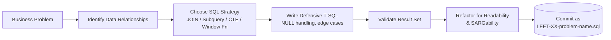

<div align="center">

# ⚡ SQL for Data Engineering Lab

### *Bridging Analytical Query Patterns & Production Engineering*

<p align="center">
  <a href="#-overview">Overview</a> •
  <a href="#-key-highlights">Highlights</a> •
  <a href="#-tech-stack--query-pipeline">Tech Stack</a> •
  <a href="#-repository-structure">Structure</a> •
  <a href="#-getting-started">Getting Started</a> •
  <a href="#-usage--examples">Usage</a> •
  <a href="#-progress-tracker">Progress</a> •
  <a href="#-engineering-notes--key-learnings">Learnings</a> •
  <a href="#-roadmap">Roadmap</a>
</p>

<p align="center">
  
  
  
  
  
  
  
</p>

</div>

---

## 📌 Overview

**SQL for Data Engineering Lab** is a repository dedicated entirely to solving the **LeetCode SQL 50** — all 50 problems, each treated as a self-contained engineering exercise rather than a throwaway answer. The goal for every problem is to understand *why* the query works and *where* the same pattern shows up in a real ETL or warehouse pipeline (deduplication, incremental loads, data quality checks, analytical windows).

The repository doubles as a **query-pattern reference library**: every solution is stored as an independent, runnable `.sql` file, organized so a specific technique (a self-join, a correlated subquery, a window function) can be located and reused in seconds.

---

## 🎯 Key Highlights

- **Pattern-first, not answer-first** — every solution maps back to a reusable Data Engineering technique (dedup logic, NULL-safe transforms, incremental aggregation, ranking/Top-N).
- **Defensive SQL by default** — explicit `NULL` handling with `ISNULL()` / `COALESCE()`, careful use of `LEFT JOIN` vs. `INNER JOIN` to avoid silent row loss, and attention to three-valued logic (3VL) edge cases.
- **SARGable, index-aware query writing** — queries are written to stay optimizer-friendly rather than relying on brute-force scans.
- **One problem, one file** — a strict `LEET-XX-problem-name.sql` naming convention keeps the repo browsable and diff-friendly as it grows.
- **Live progress tracking** — a maintained problem-by-problem table (concept, difficulty, link) doubles as a personal SQL competency map.

---

## 🛠️ Tech Stack & Query Pipeline

| Technology | Role |
|---|---|
| **Microsoft SQL Server** | Database engine used to execute and validate every query |
| **T-SQL** | Primary SQL dialect (window functions, CTEs, `ISNULL`/`COALESCE`, stored procedures) |
| **SQL Server Management Studio (SSMS)** | Query authoring, execution plan inspection, index awareness |
| **LeetCode SQL 50** | Source of structured, progressively harder problems |
| **Git & GitHub** | Version control, one commit per solved problem/documentation update |

**Conceptual flow — how each problem is worked:**



---

## 📂 Repository Structure

```text
SQL-for-Data-Engineering-Lab/
│
├── README.md
│
├── LEET-01-recyclable-and-low-fat-products.sql
├── LEET-02-find-customer-referee.sql
├── LEET-03-big-countries.sql
├── LEET-04-article-views-i.sql
├── LEET-05-invalid-tweets.sql
├── ...
├── LEET-18-percentage-of-users-attended-a-contest.sql
├── LEET-19-queries-quality-and-percentage.sql
└── LEET-20-monthly-transactions-i.sql
```

**Naming convention:** `LEET-XX-problem-name.sql` — each LeetCode problem lives in its own independent, self-documenting file. No shared setup script; every file assumes LeetCode's standard schema/sample data for that problem, so files can be opened and run in isolation.

---

## 🚀 Getting Started

### Prerequisites
- Microsoft SQL Server (2019+ recommended) or SQL Server Express
- SQL Server Management Studio (SSMS) or Azure Data Studio
- The relevant LeetCode problem's sample schema loaded (each `.sql` file's header comment lists which problem/table schema it targets)

### Setup

```bash
# 1. Clone the repository
git clone https://github.com/ahmed-ibrahim-EG/SQL-for-Data-Engineering-Lab.git
cd SQL-for-Data-Engineering-Lab

# 2. Open the repo folder in SSMS / Azure Data Studio
#    (or open individual .sql files directly)
```

No package installation or environment variables are required — this is a pure T-SQL repository. Each script is written to run against the table schema defined by its corresponding LeetCode problem.

---

## 💡 Usage & Examples

Open any `LEET-XX-*.sql` file and run it against the matching sample tables. Example:

**`LEET-09-rising-temperature.sql`** — self-join on a date-shifted copy of the same table:

```sql
SELECT w2.id
FROM Weather w1
JOIN Weather w2
  ON DATEDIFF(DAY, w1.recordDate, w2.recordDate) = 1
WHERE w2.temperature > w1.temperature;
```

**Expected output:**

| id |
|----|
| 2  |
| 4  |

Each file follows the same pattern: a short comment block stating the problem and the core concept it demonstrates, followed by the query itself — no external dependencies, no fixtures beyond LeetCode's own sample data.

---

## 📊 Progress Tracker

**20 / 50 problems completed — 40%**

```
████████████████████░░░░░░░░░░░░  40%
```

| # | Problem | Core Concept | Difficulty | Solution |
|---|---|---|---|---|
| 01 | Recyclable and Low Fat Products | Filtering & Boolean Logic | 🟢 Easy | [View SQL](./LEET-01-recyclable-and-low-fat-products.sql) |
| 02 | Find Customer Referee | NULL Handling & 3VL | 🟢 Easy | [View SQL](./LEET-02-find-customer-referee.sql) |
| 03 | Big Countries | Compound Predicates | 🟢 Easy | [View SQL](./LEET-03-big-countries.sql) |
| 04 | Article Views I | `DISTINCT` & Filtering | 🟢 Easy | [View SQL](./LEET-04-article-views-i.sql) |
| 05 | Invalid Tweets | `LEN()` & String Functions | 🟢 Easy | [View SQL](./LEET-05-invalid-tweets.sql) |
| 06 | Replace Employee ID With Unique Identifier | `LEFT JOIN` | 🟢 Easy | [View SQL](./LEET-06-replace-employee-id-with-unique-identifier.sql) |
| 07 | Product Sales Analysis I | Multi-table JOINs | 🟢 Easy | [View SQL](./LEET-07-product-sales-analysis-i.sql) |
| 08 | Customers Who Visited Without Transactions | Anti-JOIN & `IS NULL` | 🟢 Easy | [View SQL](./LEET-08-customer-who-visited-without-transactions.sql) |
| 09 | Rising Temperature | Self-JOIN & `DATEDIFF()` | 🟢 Easy | [View SQL](./LEET-09-rising-temperature.sql) |
| 10 | Average Time of Process per Machine | Aggregation & Grouping | 🟡 Medium | [View SQL](./LEET-10-average-time-of-process-per-machine.sql) |
| 11 | Students and Examinations | `CROSS JOIN` & `LEFT JOIN` | 🟢 Easy | [View SQL](./LEET-11-students-and-examinations.sql) |
| 12 | Managers with at Least 5 Direct Reports | Self-JOIN & `HAVING` | 🟡 Medium | [View SQL](./LEET-12-managers-with-at-least-5-direct-reports.sql) |
| 14 | Confirmation Rate | `CASE WHEN` & Conditional Aggregation | 🟡 Medium | [View SQL](./LEET-14-confirmation-rate.sql) |
| 15 | Not Boring Movies | Modulo & Sorting | 🟢 Easy | [View SQL](./LEET-15-not-boring-movies.sql) |
| 16 | Average Selling Price | JOINs, Date Ranges & NULL Handling | 🟢 Easy | [View SQL](./LEET-16-average-selling-price.sql) |
| 17 | Project Employees I | JOINs, Aggregation & `AVG()` | 🟢 Easy | [View SQL](./LEET-17-project-employees-i.sql) |
| 18 | Percentage of Users Attended a Contest | Aggregation, Subquery & `ROUND()` | 🟢 Easy | [View SQL](./LEET-18-percentage-of-users-attended-a-contest.sql) |
| 19 | Queries Quality and Percentage | Conditional Aggregation, `AVG()` & `ROUND()` | 🟢 Easy | [View SQL](./LEET-19-queries-quality-and-percentage.sql) |
| 20 | Monthly Transactions I | Conditional Aggregation & Date Grouping | 🟢 Easy | [View SQL](./LEET-20-monthly-transactions-i.sql) |

> Problem 13 is intentionally skipped in the current pass and will be filled in during a later cleanup commit.

---

## 🧠 Engineering Notes & Key Learnings

- **NULL handling isn't optional** — several early problems (e.g., Find Customer Referee) hinge entirely on correct 3-valued-logic reasoning; a naive `!=` predicate silently drops valid rows.
- **JOIN choice changes correctness, not just performance** — anti-JOIN patterns (`LEFT JOIN ... WHERE right.id IS NULL`) are used deliberately instead of `NOT IN`, which breaks silently in the presence of NULLs on the subquery side.
- **Self-joins as a stand-in for time-series comparison** — problems like Rising Temperature demonstrate a pattern used constantly in DE pipelines: comparing a row to "yesterday's" or "the previous period's" row without a dedicated lag table.
- **Conditional aggregation over multiple `CASE WHEN` passes** — used for computing rates/percentages (Confirmation Rate, Queries Quality) in a single scan rather than multiple correlated subqueries, which is closer to how these metrics would be computed in a warehouse aggregation layer.
- **Readability is treated as a correctness concern** — queries are refactored for SARGability and clarity even after they return the right answer, since unreadable SQL is a liability in a real pipeline's maintenance cost.

---

## 🔭 Roadmap

**In progress**
- [ ] Complete remaining LeetCode SQL 50 problems (30 remaining)
- [ ] Advanced window functions (framing, running totals, `NTILE`)
- [ ] Deeper query optimization pass with execution-plan annotations per file

**Next**
- [ ] Production-style SQL project: staging → transformation → warehouse workflow
- [ ] Star schema implementation exercise
- [ ] SQL + Python ETL integration (this repo's patterns feeding a pandas/pyodbc pipeline)
- [ ] Formal data-validation query library (reusable quality-check templates)

---

## 📈 Learning Philosophy

> Don't just solve the query — understand *why* it works.

Every problem here is worked through the same chain: **Problem → Data Relationships → SQL Logic → Query → Result**, with the explicit goal of building SQL judgment that transfers directly into real Data Engineering pipelines, not just LeetCode point-scoring.

---

## 👤 Author & Contact

**Ahmed Ibrahim** — CS Student & Aspiring Data Engineer

[](https://github.com/ahmed-ibrahim-EG)
[](https://www.linkedin.com/in/ahmed-ibrahim-36600b2a5)

<div align="center">

⚡ *Building SQL Skills for Real Data Engineering Workflows* ⚡

**20 / 50 • 40% Complete**

</div>
