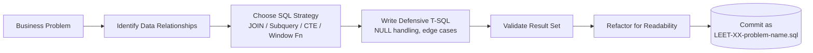

<div align="center">

# ⚡ SQL for Data Engineering Lab

### *Bridging Analytical Query Patterns & Production Engineering*

<p align="center">
  <a href="#-overview">Overview</a> •
  <a href="#-key-highlights">Highlights</a> •
  <a href="#-tech-stack--query-pipeline">Tech Stack</a> •
  <a href="#-repository-structure">Structure</a> •
  <a href="#-getting-started">Getting Started</a> •
  <a href="#-usage--examples">Usage</a> •
  <a href="#-progress-tracker">Progress</a> •
  <a href="#-engineering-notes--key-learnings">Learnings</a> •
  <a href="#-roadmap">Roadmap</a>
</p>

<p align="center">
  
  
  
  
</p>

</div>

---

## 📌 Overview

**SQL for Data Engineering Lab** is a repository dedicated entirely to solving the **LeetCode SQL 50** — all 50 problems, each treated as a self-contained engineering exercise rather than a throwaway answer.

The goal for every problem is to understand *why* the query works and *where* the same pattern appears in real Data Engineering workflows such as deduplication, incremental loads, data quality checks, aggregation, and analytical transformations.

The repository also serves as a **query-pattern reference library**: every solution is stored as an independent, runnable `.sql` file, organized so a specific technique — such as a self-join, correlated subquery, CTE, or window function — can be located and reused quickly.

---

## 🎯 Key Highlights

* **Pattern-first, not answer-first** — every solution maps back to a reusable SQL / Data Engineering technique.
* **Defensive SQL by default** — explicit `NULL` handling, careful JOIN selection, and attention to edge cases and three-valued logic.
* **Window-function practice** — practical use of `LAG()`, `LEAD()`, `ROW_NUMBER()`, `MIN() OVER()` and cumulative calculations.
* **One problem, one file** — a strict `LEET-XX-problem-name.sql` naming convention keeps the repository organized and easy to navigate.
* **Problem-by-problem progress tracking** — every completed problem is documented with its main SQL concept and difficulty.
* **Data Engineering perspective** — solutions focus not only on passing LeetCode but also on recognizing patterns applicable to ETL, ELT, analytics, and warehouse workloads.

---

## 🛠️ Tech Stack & Query Pipeline

| Technology                              | Role                                                 |
| --------------------------------------- | ---------------------------------------------------- |
| **Microsoft SQL Server**                | Database engine used to execute and validate queries |
| **T-SQL**                               | Primary SQL dialect                                  |
| **SQL Server Management Studio (SSMS)** | Query authoring and execution                        |
| **LeetCode SQL 50**                     | Source of structured SQL problems                    |
| **Git & GitHub**                        | Version control and repository management            |

**Conceptual flow — how each problem is worked:**


```mermaid
flowchart LR
    A[Business Problem] --> B[Identify Data Relationships]
    B --> C[Choose SQL Strategy<br/>JOIN / Subquery / CTE / Window Fn]
    C --> D[Write Defensive T-SQL<br/>NULL handling, edge cases]
    D --> E[Validate Result Set]
    E --> F[Refactor for Readability]
    F --> G[(Commit as<br/>LEET-XX-problem-name.sql)]
```

---

## 📂 Repository Structure

```text
SQL-for-Data-Engineering-Lab/
│
├── README.md
│
├── LEET-01-recyclable-and-low-fat-products.sql
├── LEET-02-find-customer-referee.sql
├── LEET-03-big-countries.sql
├── LEET-04-article-views-i.sql
├── LEET-05-invalid-tweets.sql
├── ...
├── LEET-18-percentage-of-users-attended-a-contest.sql
├── LEET-19-queries-quality-and-percentage.sql
├── LEET-20-monthly-transactions-i.sql
├── LEET-21-immediate-food-delivery-ii.sql
├── LEET-22-game-play-analysis-iv.sql
├── LEET-23-number-of-unique-subjects-taught-by-each-teacher.sql
├── LEET-24-daily-active-user-count.sql
├── LEET-25-first-year-sales.sql
├── LEET-26-classes-more-than-5-students.sql
├── LEET-27-find-followers-count.sql
├── LEET-28-biggest-single-number.sql
├── LEET-29-customers-who-bought-all-products.sql
├── LEET-30-employees-with-reports.sql
├── LEET-31-primary-department-for-each-employee.sql
├── LEET-32-triangle-judgement.sql
├── LEET-33-consecutive-numbers.sql
├── LEET-34-product-price-at-a-given-date.sql
├── LEET-35-last-person-to-fit-in-the-bus.sql
├── LEET-36-count-salary-categories.sql
├── LEET-37-employees-whose-manager-left-the-company.sql
└── LEET-38-exchange-seats.sql
```

**Naming convention:** `LEET-XX-problem-name.sql`

Each LeetCode problem lives in its own independent SQL file. Every file can be opened and reviewed separately using the corresponding LeetCode schema.

---

## 🚀 Getting Started

### Prerequisites

* Microsoft SQL Server 2019+ or SQL Server Express
* SQL Server Management Studio (SSMS) or Azure Data Studio
* The relevant LeetCode problem's sample schema

### Setup

```bash
# 1. Clone the repository
git clone https://github.com/ahmed-ibrahim-EG/SQL-for-Data-Engineering-Lab.git

# 2. Enter the repository
cd SQL-for-Data-Engineering-Lab

# 3. Open the required .sql file in SSMS
```

No package installation or environment variables are required.

Each SQL script assumes the standard table schema provided by its corresponding LeetCode problem.

---

## 💡 Usage & Examples

Open any `LEET-XX-*.sql` file and run it against the matching sample tables.

### Example — Rising Temperature

**`LEET-09-rising-temperature.sql`**

Demonstrates a **self-join** for comparing a row with the previous day's record.

```sql
SELECT w2.id
FROM Weather w1
JOIN Weather w2
    ON DATEDIFF(DAY, w1.recordDate, w2.recordDate) = 1
WHERE w2.temperature > w1.temperature;
```

### Example — Exchange Seats

**`LEET-38-exchange-seats.sql`**

Demonstrates `LAG()`, `LEAD()`, `CASE`, and handling an odd final row.

```sql
SELECT
    id,
    CASE
        WHEN id % 2 = 1
             AND id < (SELECT MAX(id) FROM Seat)
            THEN LEAD(student) OVER (ORDER BY id)

        WHEN id % 2 = 0
            THEN LAG(student) OVER (ORDER BY id)

        ELSE student
    END AS student
FROM Seat
ORDER BY id;
```

Each file follows the same general structure:

**Problem → SQL Logic → Query → Result**

---

## 📊 Progress Tracker

**38 / 50 problems completed — 76%**

```text
████████████████████████████████████████████████████████████  76%
```

| #  | Problem                                          | Core Concept                                    | Difficulty | Solution                                                                   |
| -- | ------------------------------------------------ | ----------------------------------------------- | ---------- | -------------------------------------------------------------------------- |
| 01 | Recyclable and Low Fat Products                  | Filtering & Boolean Logic                       | 🟢 Easy    | [View SQL](./LEET-01-recyclable-and-low-fat-products.sql)                  |
| 02 | Find Customer Referee                            | NULL Handling & 3VL                             | 🟢 Easy    | [View SQL](./LEET-02-find-customer-referee.sql)                            |
| 03 | Big Countries                                    | Compound Predicates                             | 🟢 Easy    | [View SQL](./LEET-03-big-countries.sql)                                    |
| 04 | Article Views I                                  | `DISTINCT` & Filtering                          | 🟢 Easy    | [View SQL](./LEET-04-article-views-i.sql)                                  |
| 05 | Invalid Tweets                                   | `LEN()` & String Functions                      | 🟢 Easy    | [View SQL](./LEET-05-invalid-tweets.sql)                                   |
| 06 | Replace Employee ID With Unique Identifier       | `LEFT JOIN`                                     | 🟢 Easy    | [View SQL](./LEET-06-replace-employee-id-with-unique-identifier.sql)       |
| 07 | Product Sales Analysis I                         | Multi-table JOINs                               | 🟢 Easy    | [View SQL](./LEET-07-product-sales-analysis-i.sql)                         |
| 08 | Customers Who Visited Without Transactions       | Anti-JOIN & `IS NULL`                           | 🟢 Easy    | [View SQL](./LEET-08-customer-who-visited-without-transactions.sql)        |
| 09 | Rising Temperature                               | Self-JOIN & `DATEDIFF()`                        | 🟢 Easy    | [View SQL](./LEET-09-rising-temperature.sql)                               |
| 10 | Average Time of Process per Machine              | Aggregation & Grouping                          | 🟡 Medium  | [View SQL](./LEET-10-average-time-of-process-per-machine.sql)              |
| 11 | Students and Examinations                        | `CROSS JOIN` & `LEFT JOIN`                      | 🟢 Easy    | [View SQL](./LEET-11-students-and-examinations.sql)                        |
| 12 | Managers with at Least 5 Direct Reports          | Self-JOIN & `HAVING`                            | 🟡 Medium  | [View SQL](./LEET-12-managers-with-at-least-5-direct-reports.sql)          |
| 14 | Confirmation Rate                                | `CASE WHEN` & Conditional Aggregation           | 🟡 Medium  | [View SQL](./LEET-14-confirmation-rate.sql)                                |
| 15 | Not Boring Movies                                | Modulo & Sorting                                | 🟢 Easy    | [View SQL](./LEET-15-not-boring-movies.sql)                                |
| 16 | Average Selling Price                            | JOINs, Date Ranges & NULL Handling              | 🟢 Easy    | [View SQL](./LEET-16-average-selling-price.sql)                            |
| 17 | Project Employees I                              | JOINs, Aggregation & `AVG()`                    | 🟢 Easy    | [View SQL](./LEET-17-project-employees-i.sql)                              |
| 18 | Percentage of Users Attended a Contest           | Aggregation, Subquery & `ROUND()`               | 🟢 Easy    | [View SQL](./LEET-18-percentage-of-users-attended-a-contest.sql)           |
| 19 | Queries Quality and Percentage                   | Conditional Aggregation, `AVG()` & `ROUND()`    | 🟢 Easy    | [View SQL](./LEET-19-queries-quality-and-percentage.sql)                   |
| 20 | Monthly Transactions I                           | Conditional Aggregation & Date Grouping         | 🟢 Easy    | [View SQL](./LEET-20-monthly-transactions-i.sql)                           |
| 21 | Immediate Food Delivery II                       | Aggregation, Subquery & `MIN()`                 | 🟡 Medium  | [View SQL](./LEET-21-immediate-food-delivery-ii.sql)                       |
| 22 | Game Play Analysis IV                            | CTE, `MIN()`, `DATEDIFF()` & `ROUND()`          | 🟡 Medium  | [View SQL](./LEET-22-game-play-analysis-iv.sql)                            |
| 23 | Number of Unique Subjects Taught by Each Teacher | `COUNT(DISTINCT)` & `GROUP BY`                  | 🟢 Easy    | [View SQL](./LEET-23-number-of-unique-subjects-taught-by-each-teacher.sql) |
| 24 | User Activity for the Past 30 Days I             | Date Filtering & `COUNT(DISTINCT)`              | 🟢 Easy    | [View SQL](./LEET-24-daily-active-user-count.sql)                          |
| 25 | Product Sales Analysis III                       | Window Functions & `MIN() OVER()`               | 🟡 Medium  | [View SQL](./LEET-25-first-year-sales.sql)                                 |
| 26 | Classes More Than 5 Students                     | `GROUP BY`, `COUNT()` & `HAVING`                | 🟢 Easy    | [View SQL](./LEET-26-classes-more-than-5-students.sql)                     |
| 27 | Find Followers Count                             | `COUNT()` & `GROUP BY`                          | 🟢 Easy    | [View SQL](./LEET-27-find-followers-count.sql)                             |
| 28 | Biggest Single Number                            | `MAX()`, `GROUP BY` & Subquery                  | 🟢 Easy    | [View SQL](./LEET-28-biggest-single-number.sql)                            |
| 29 | Customers Who Bought All Products                | `COUNT(DISTINCT)`, `GROUP BY` & Subquery        | 🟡 Medium  | [View SQL](./LEET-29-customers-who-bought-all-products.sql)                |
| 30 | Employees With Reports                           | CTE, Aggregation & Self-JOIN                    | 🟢 Easy    | [View SQL](./LEET-30-employees-with-reports.sql)                           |
| 31 | Primary Department for Each Employee             | `EXISTS` / `NOT EXISTS` & Correlated Subqueries | 🟡 Medium  | [View SQL](./LEET-31-primary-department-for-each-employee.sql)             |
| 32 | Triangle Judgement                               | `CASE WHEN` & Conditional Logic                 | 🟢 Easy    | [View SQL](./LEET-32-triangle-judgement.sql)                               |
| 33 | Consecutive Numbers                              | `LAG()` & Window Functions                      | 🟡 Medium  | [View SQL](./LEET-33-consecutive-numbers.sql)                              |
| 34 | Product Price at a Given Date                    | CTE, `MAX()`, JOIN & `CASE WHEN`                | 🟡 Medium  | [View SQL](./LEET-34-product-price-at-a-given-date.sql)                    |
| 35 | Last Person to Fit in the Bus                    | Cumulative `SUM()` & Window Functions           | 🟡 Medium  | [View SQL](./LEET-35-last-person-to-fit-in-the-bus.sql)                    |
| 36 | Count Salary Categories                          | `CASE`, CTE, `LEFT JOIN` & `GROUP BY`           | 🟢 Easy    | [View SQL](./LEET-36-count-salary-categories.sql)                          |
| 37 | Employees Whose Manager Left the Company         | Subquery & `NOT IN`                             | 🟢 Easy    | [View SQL](./LEET-37-employees-whose-manager-left-the-company.sql)         |
| 38 | Exchange Seats                                   | `LAG()`, `LEAD()` & `CASE`                      | 🟡 Medium  | [View SQL](./LEET-38-exchange-seats.sql)                                   |

> **Problem 13** is intentionally skipped in the current pass and will be filled in during a later cleanup commit.

---

## 🧠 Engineering Notes & Key Learnings

* **NULL handling isn't optional** — correct SQL often depends on understanding three-valued logic and how `NULL` affects predicates.
* **JOIN choice affects correctness** — `LEFT JOIN`, `INNER JOIN`, and anti-join patterns can produce fundamentally different result sets.
* **Self-joins enable row-to-row comparisons** — useful for time-series analysis and comparing related records.
* **Conditional aggregation** — `CASE WHEN` combined with aggregate functions is useful for building metrics and categorical summaries.
* **First-row-per-entity pattern** — identifying the earliest record for each entity is a common warehouse and analytics requirement.
* **Distinct counting at the entity level** — `COUNT(DISTINCT ...)` prevents duplicate relationships from inflating metrics.
* **Relational division** — comparing entity coverage against a complete reference set solves "all" requirements.
* **Correlated subqueries** — `EXISTS` / `NOT EXISTS` can express entity-specific conditions without unnecessary joins.
* **Consecutive-row detection** — `LAG()` provides a clean way to compare the current row with previous records.
* **Point-in-time logic** — selecting the latest effective record before a cutoff date is a common pattern in historical and warehouse data.
* **Cumulative window calculations** — running `SUM()` can model progressive totals and threshold-based decisions.
* **Category completeness** — generating a fixed set of categories and using `LEFT JOIN` ensures required categories remain visible even when their count is zero.
* **Missing-reference detection** — subqueries can identify records referencing entities that no longer exist.
* **Row swapping with window functions** — `LAG()` and `LEAD()` can transform row relationships while preserving the original row identifiers.

---

## 🔭 Roadmap

### In Progress

* [ ] Complete the remaining **12 LeetCode SQL 50 problems**
* [ ] Continue practicing advanced window-function patterns
* [ ] Review edge cases involving `NULL`, duplicates, and missing relationships

### Next

* [ ] Advanced window functions — framing, running totals, `NTILE()`
* [ ] Query optimization and execution-plan analysis
* [ ] Production-style SQL project: staging → transformation → warehouse workflow
* [ ] Star schema implementation exercise
* [ ] SQL + Python ETL integration
* [ ] Reusable SQL data-validation query library

---

## 📈 Learning Philosophy

> Don't just solve the query — understand *why* it works.

Every problem is approached through the same chain:

**Problem → Data Relationships → SQL Logic → Query → Result**

The goal is not simply to collect LeetCode solutions, but to build SQL judgment that transfers into real **Data Engineering**, **ETL**, **ELT**, **Analytics**, and **Data Warehouse** workflows.

---

## 👤 Author & Contact

**Ahmed Ibrahim** — CS Student & Aspiring Data Engineer

[](https://github.com/ahmed-ibrahim-EG)

[](https://www.linkedin.com/in/ahmed-ibrahim-36600b2a5)

<div align="center">

⚡ *Building SQL Skills for Real Data Engineering Workflows* ⚡

**38 / 50 • 76% Complete**

</div>
